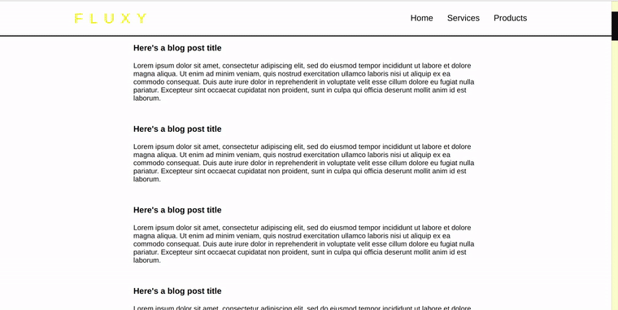

## ( in progress )

# React Navbar Change Background Color on Scroll

<br>

[](https://nadiamariduena.github.io/react-responsive1/)

<br>
<br>

<br>

<!-- ```javascript

npm i react

npm i react-dom

npm i react-scripts

npm i node-sass --save

npm i autoprefixer@9.8.0

npm i gh-pages --save-dev


npm i react-router-dom
``` -->

<br>
<br>
<br>

---

# UPDATE

##### 24/11/2021

#### I will be using _styled components_ for this one:

<br>

[](https://github.com/nadiamariduena/e-commerce-react-stripe)

<br>

##### [update | change font and color of the LOGO on scroll](https://github.com/nadiamariduena/e-commerce-react-stripe)

> 15 months later I created this new version, its a bit similar but has more flavour 🍭

<br><br><br>

```javascript
import React, { useEffect, useState } from "react";
import styled from "styled-components";
import { IconButton, Badge } from "@material-ui/core";
// icons
import { ShoppingCartOutlined } from "@material-ui/icons";
import { Link, useLocation } from "react-router-dom";

//

import useStyles from "./styles";

//
//
const Header = styled.div`
  width: 100%;
  display: flex;
  justify-content: space-around;
  flex-direction: row;
`;
const Navigation = styled.div`
  width: 100%;
  display: flex;
  justify-content: space-between;
  flex-direction: row;
  flex-grow: 1;
  //
  //
  position: fixed;
  top: 0;
  z-index: 3;
  min-height: 8vh;
  transition: background-color 0.6s ease-in-out;
  /* border-bottom: 1px solid #121212; */
  .black {
    color: #000000;
    font-family: "RobotoBlack";
    /* 
 */
    margin-left: 20px;
    margin-top: 10px;
    text-decoration: none;
    font-size: 1.7em;
    font-weight: 600;
    letter-spacing: 15px;
    /*  */
  }
  .white {
    display: flex;
    flex-grow: 1;
    align-items: center;
    margin-left: 20px;
    margin-top: 10px;
    text-decoration: none;
    //
    /* font-style: italic; */
    color: rgb(248, 248, 248);
    font-family: "Syncopate-Regular";
    font-size: 1.7em;
    font-weight: 600;
    letter-spacing: 7px;
  }
  /* .scroll {
    background-color: #ffffff;
  } */
`;
const TitleLogo = styled.div`
  display: flex;
  flex-grow: 1;
  align-items: center;
  margin-left: 20px;
  margin-top: 10px;
  text-decoration: none;
  //
  /* font-style: italic; */
  color: rgb(248, 248, 248);
  font-size: 1.7em;
  font-weight: 600;
  letter-spacing: 7px;
  font-family: "Syncopate-Regular";
  /* font-family: "Syncopate-Bold"; */
  /* font-family: "RobotoBlack"; */
  /* font-weight: 600;
  letter-spacing: 7px; */
`;
//
//
//
//
const Navbar = ({ totalItems }) => {
  //
  const classes = useStyles();
  const location = useLocation();
  //
  //
  //
  //
  const [navbar, setNavbar] = useState(false);
  const [color, setColor] = useState(false);

  //
  //
  //CHANGE FONT ON SCROLL---------------------
  const changeFontOnScroll = () => {
    if (window.scrollY >= 700) {
      setNavbar(true);
      setColor("black");
    } else {
      setNavbar(false);
      setColor("white");
    }
  };
  //
  useEffect(() => {
    window.addEventListener("scroll", changeFontOnScroll, true);
    return () => window.removeEventListener("scroll", changeFontOnScroll);
  }, []);
  //
  //
  //  SHOW ARROW 'BACK TO TOP' ON SCROLL---------------------
  //
  return (
    <>
      <Header
        className={navbar ? "scroll" : "navbar"}
        // style={{
        //   backgroundColor: "white",
        // }}
      >
        <Navigation>
          <Link to="/">
            <TitleLogo className={color}>NEMU</TitleLogo>
          </Link>

          {location.pathname === "/" && (
            <div>
              <IconButton
                className={classes.IconCartNavBar}
                component={Link}
                to="/cart"
                aria-label="Show cart items"
              >
                <Badge
                  badgeContent={totalItems}
                  color="secondary"
                  classes={{ badge: classes.customBadge }}
                >
                  {/* ShoppingCartOutlined  is the icon */}
                  <ShoppingCartOutlined />
                </Badge>
              </IconButton>
            </div>
          )}
        </Navigation>
      </Header>
    </>
  );
};
export default Navbar;
```
